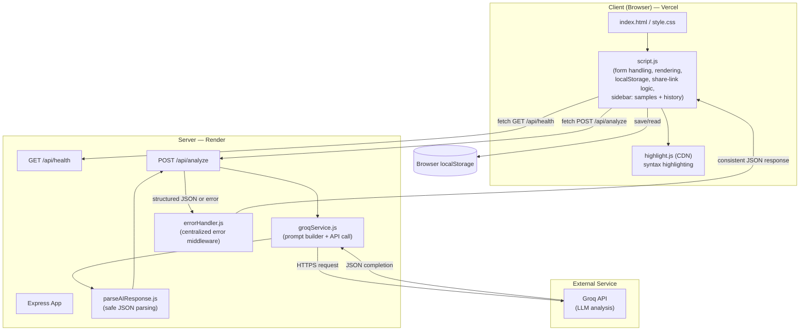
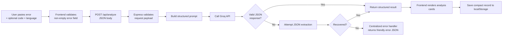
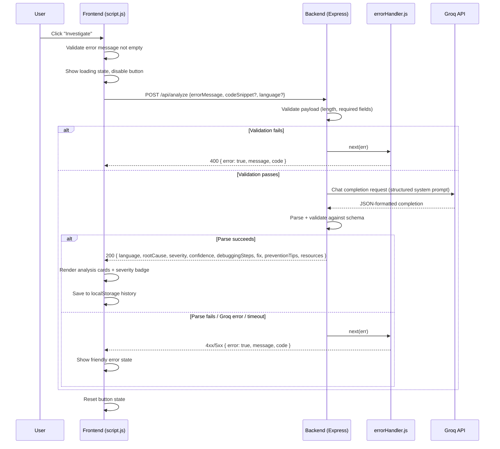
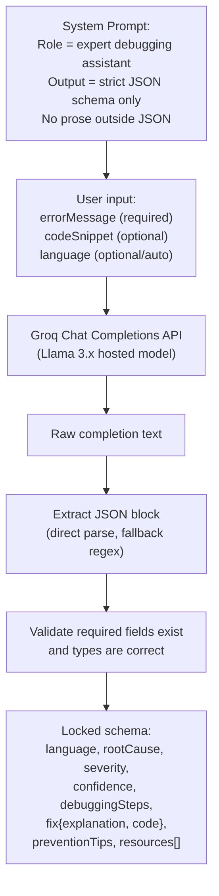
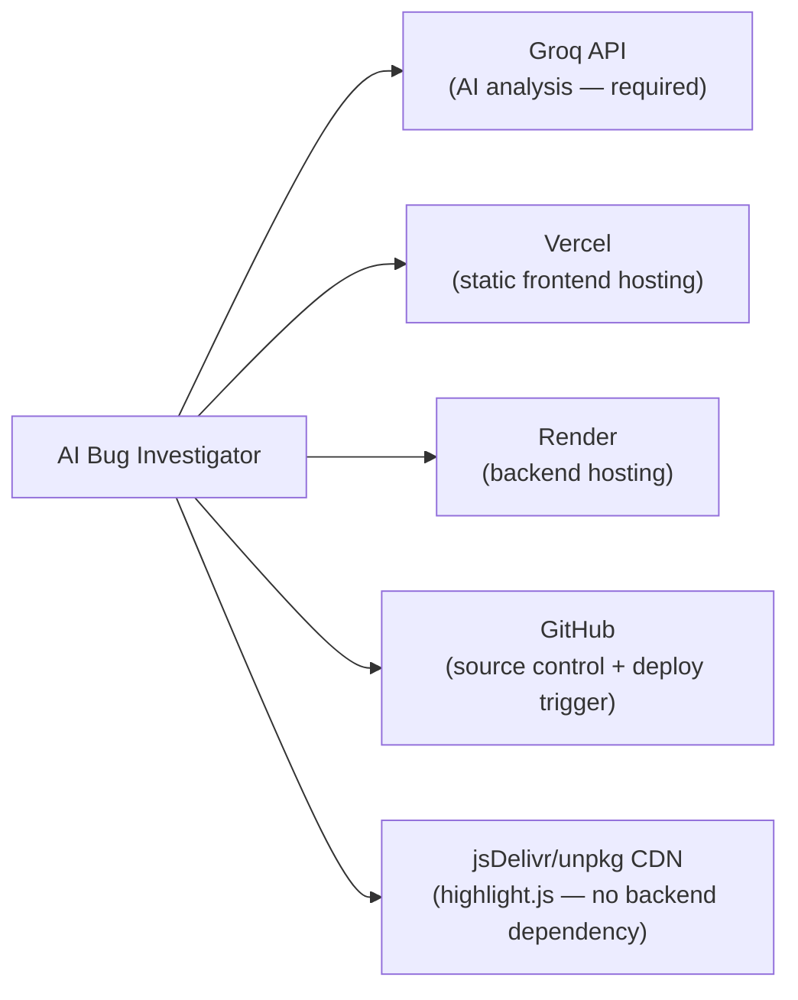

# ARCHITECTURE.md — AI Bug Investigator

**Status:** Approved Day 2 · v1.0
**Source of truth for:** system design, component responsibilities, request lifecycle, AI interaction, external services

---

## 1. Tech Stack Summary

| Layer | Choice | Rationale |
|---|---|---|
| Frontend | Vanilla HTML/CSS/JavaScript | No auth/routing complexity needed; avoids unnecessary build tooling. |
| Backend | Node.js + Express | Familiar stack, simple proxy layer to keep the Groq API key server-side. |
| Database | None (v1.0) | Stateless by design — no accounts in v1.0. |
| Authentication | None (v1.0) | No accounts to authenticate. |
| AI Provider | Groq API | Already available; fast inference fits the "quick investigate" UX goal. |
| Frontend Hosting | Vercel (free tier) | Zero-config static hosting with HTTPS by default. |
| Backend Hosting | Render (free tier) | Simple Node/Express deploys, sufficient for portfolio-scale traffic. |
| Other tools | `dotenv`, `cors`, `highlight.js` (CDN) | Minimal, free, no build-step dependencies. |

---

## 2. Component Diagram



---

## 3. Data Flow



---

## 4. Request Lifecycle



---

## 5. AI Interaction



---

## 6. External Services



---

## 7. Centralized Error Handling (Day 2 addition)

A single Express error-handling middleware, `server/middleware/errorHandler.js`, sits at the end of the middleware chain. Every route funnels errors through `next(err)` rather than handling errors inconsistently per-route.

**Consistent error response contract:**
```json
{ "error": true, "message": "Human-readable message", "code": "OPTIONAL_ERROR_CODE" }
```

Covers: validation failures, Groq timeouts, malformed AI JSON responses, and unexpected exceptions.

---

## 8. Future-Ready Notes (v2.0 — not built in v1.0)

The architecture intentionally leaves room for a v2.0 without requiring a restructure:

- **Database:** MongoDB, introduced via a new `server/models/` folder. Likely collections: `users`, `analyses`.
- **Authentication:** JWT-based, introduced via `server/middleware/auth.js`, slotting in alongside the existing `errorHandler.js` middleware pattern.
- **New capabilities unlocked by v2.0:** cloud-synced history, saved analyses, personalized dashboard.

None of this is implemented in v1.0 — it is documented here only so future work has a clear, non-disruptive entry point.
