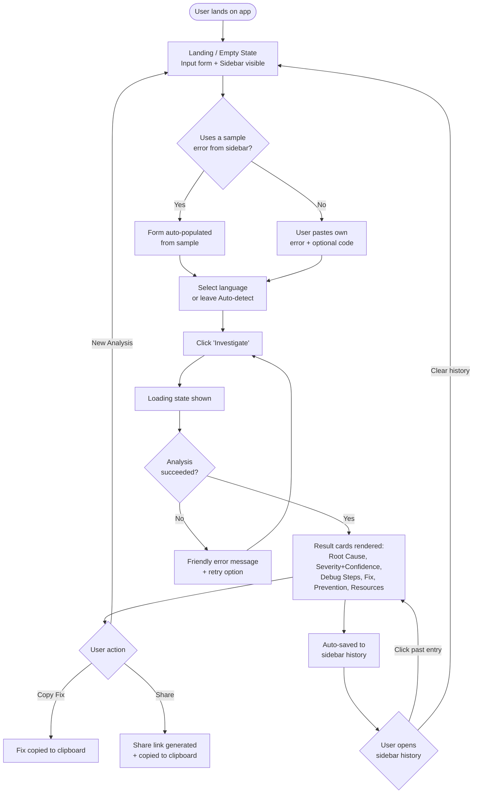
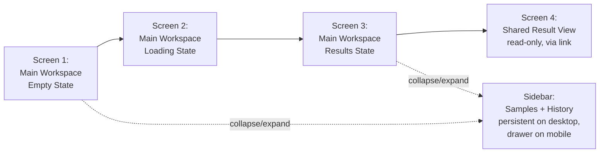

# UI-WIREFRAMES.md — AI Bug Investigator

**Status:** Approved Day 2 · v1.0
**Design language:** Dark, IDE-inspired debugging workspace — not a chatbot, not a multi-page SaaS app.

---

## 1. User Flow Diagram



---

## 2. Screen Flow



Four real screens/states, plus one persistent structural element (the sidebar). Every screen exists for a specific reason:
- **Empty State** — onboarding + sample discovery
- **Loading State** — feedback during the Groq round-trip
- **Results State** — the core value delivery
- **Shared Result View** — serves FR-13 for someone without prior app context

---

## 3. Low-Fidelity Wireframes

### Desktop — Empty State (with sidebar)
```
┌──────────────┬────────────────────────────────────────────┐
│ ◂ SIDEBAR     │  AI BUG INVESTIGATOR                       │
│              │──────────────────────────────────────────  │
│ ▾ Samples    │  Paste an error. Understand it. Fix it.     │
│  • TypeError │                                              │
│  • KeyError  │  ┌────────────────────────────────────┐    │
│  • NullPtr   │  │ Error message / stack trace *       │    │
│  • SQL Err   │  │                                      │    │
│  • …         │  └────────────────────────────────────┘    │
│              │  ┌────────────────────────────────────┐    │
│ ▾ History    │  │ Related code (optional)             │    │
│  (empty)     │  └────────────────────────────────────┘    │
│              │  Language: [Auto-detect ▾]                  │
│              │                                              │
│              │            [  Investigate  ]                │
└──────────────┴────────────────────────────────────────────┘
```

### Desktop — Results State (sidebar collapsed example)
```
┌─┬──────────────────────────────────────────────────────────┐
│▸│  AI BUG INVESTIGATOR                     [New Analysis]   │
├─┼──────────────────────────────────────────────────────────┤
│ │  [CRITICAL]  Confidence: 92%                              │
│ │                                                            │
│ │  ▸ Root Cause                                             │
│ │    ...explanation...                                      │
│ │                                                            │
│ │  ▸ Debugging Steps                                        │
│ │    1. ...   2. ...   3. ...                               │
│ │                                                            │
│ │  ▸ Suggested Fix                        [Copy fix]        │
│ │    ```code block, syntax highlighted```                   │
│ │                                                            │
│ │  ▸ Prevention Tips                                        │
│ │    • ...   • ...                                          │
│ │                                                            │
│ │  ▸ Related Resources                                      │
│ │    🔗 ...   🔗 ...                                        │
│ │                                                            │
│ │              [ Share this result ]                        │
└─┴──────────────────────────────────────────────────────────┘
```

### Mobile — Empty State (sidebar as drawer)
```
┌─────────────────────────────────────┐
│  ☰   AI BUG INVESTIGATOR            │  ← ☰ opens sidebar as slide-out drawer
├─────────────────────────────────────┤
│  Paste an error. Understand it.     │
│                                      │
│  ┌────────────────────────────┐    │
│  │ Error message / stack trace │    │
│  └────────────────────────────┘    │
│  ┌────────────────────────────┐    │
│  │ Related code (optional)     │    │
│  └────────────────────────────┘    │
│  Language: [Auto-detect ▾]          │
│                                      │
│         [  Investigate  ]           │
└─────────────────────────────────────┘
```

### Mobile — Sidebar Drawer (open, overlay)
```
┌─────────────────────────────────────┐
│  ✕ Samples & History                │
├─────────────────────────────────────┤
│  ▾ Samples                          │
│   • TypeError  • KeyError  • …      │
│                                      │
│  ▾ History                    [Clear]│
│   • TypeError · JS · High           │
│   • KeyError · Python · Medium      │
└─────────────────────────────────────┘
```

---

## 4. Sidebar Component Detail (Day 2 addition)

- **Desktop:** persistent left sidebar, collapsible via a toggle control (`◂`/`▸`). Contains two sections: **Samples** (static list, click to populate form) and **History** (dynamic, localStorage-backed, click to reopen a past result, with a "Clear" action).
- **Mobile:** the same sidebar content is presented as a slide-out drawer, triggered by a hamburger (`☰`) icon in the top bar, closed via an `✕` icon or tapping outside the drawer.
- This single component replaces what was originally planned as a separate "History Panel overlay" — consolidating sample library and history into one IDE-style panel, per your Day 2 refinement.

---

## 5. Navigation

- **No multi-page navigation, no router.** Single-page app with state-driven view swapping (Empty ↔ Loading ↔ Results) plus one collapsible structural element (the sidebar) and one alternate entry point (Shared Result View, reached only via a `?result=` URL).
- This matches the product's core positioning: speed and focus — paste → answer, minimal clicks, no unnecessary screens.
